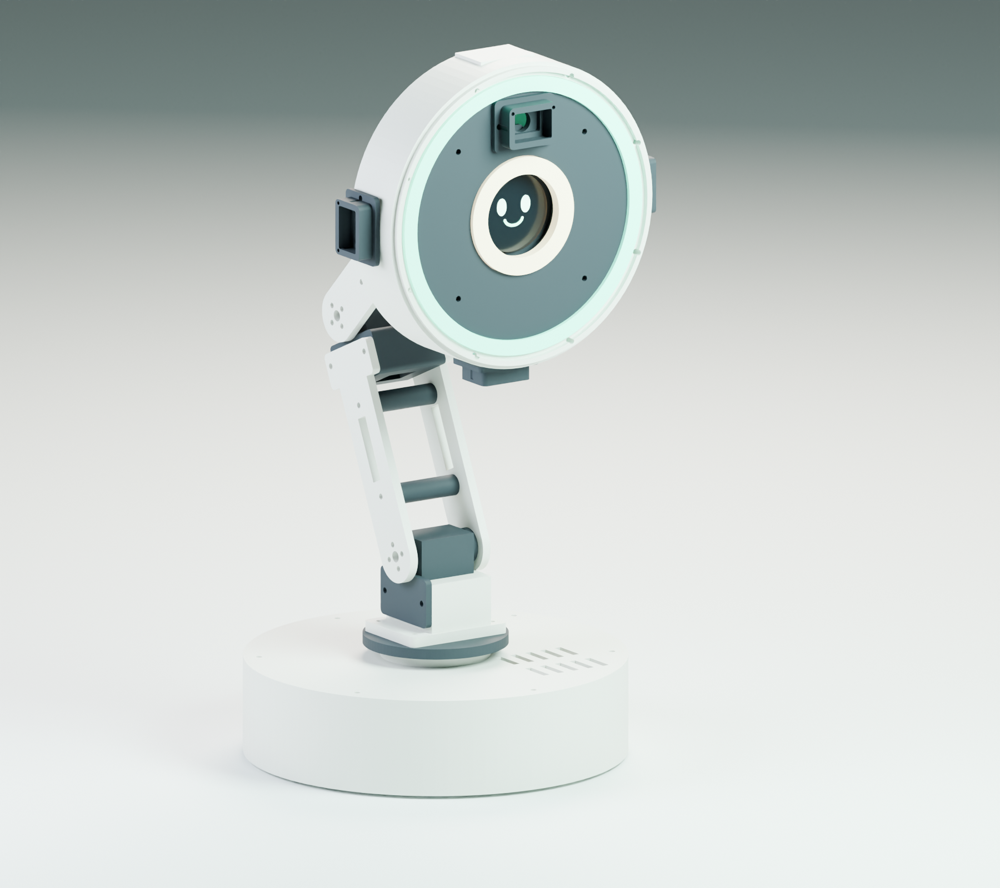
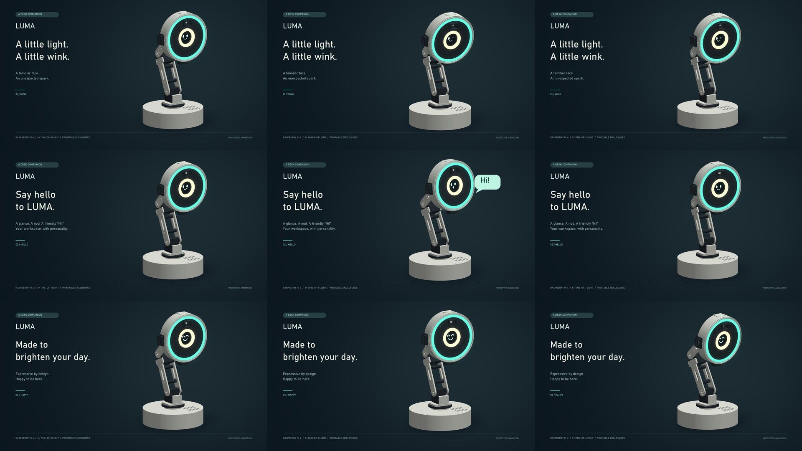
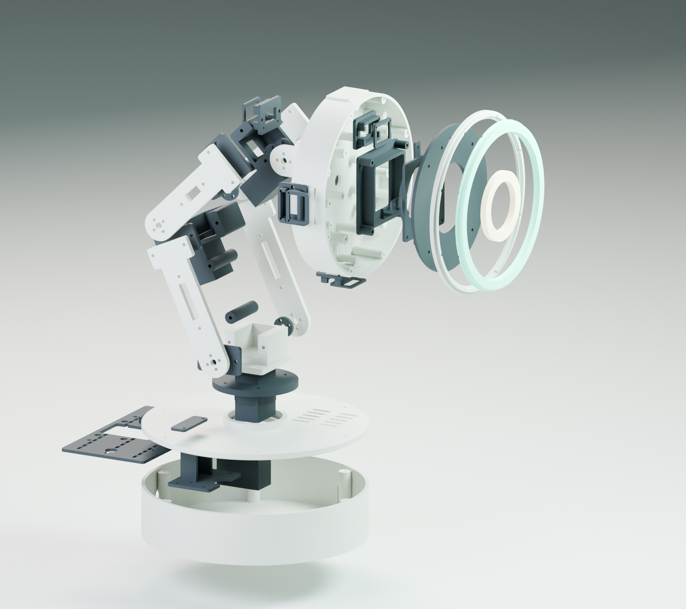

# Finished design and promotional films

The promotional films show the LUMA digital prototype built from the supplied CAD geometry. The lighting, camera exposure, screen graphics and sound are presentation choices; the films do not establish the physical lamp's brightness, motor sound or production finish.

## The three films

| Film | Included file | Action |
| --- | --- | --- |
| The wink | `media/videos/01_wink.mp4` | A brief one-eye wink with a coordinated head gesture and colored halo. |
| Hi, there | `media/videos/02_hi.mp4` | A friendly face greeting, arm gesture and an audible “Hi!” |
| Happy to see you | `media/videos/03_happy.mp4` | Cheerful eyes and a small happy movement, with warm halo color. |

Open `START_HERE.html` in a browser after extracting the archive to play all three clips. The videos are also individual files for editing or presentation use. The project includes editable animation sources under `media/sources/`.

## Assembly visualization

The engineering sheets at the back of the manual are the dimensional references. The rendered images explain appearance and assembly relationships; use the numbered assembly sequence for fasteners, wiring and the optical stack.
