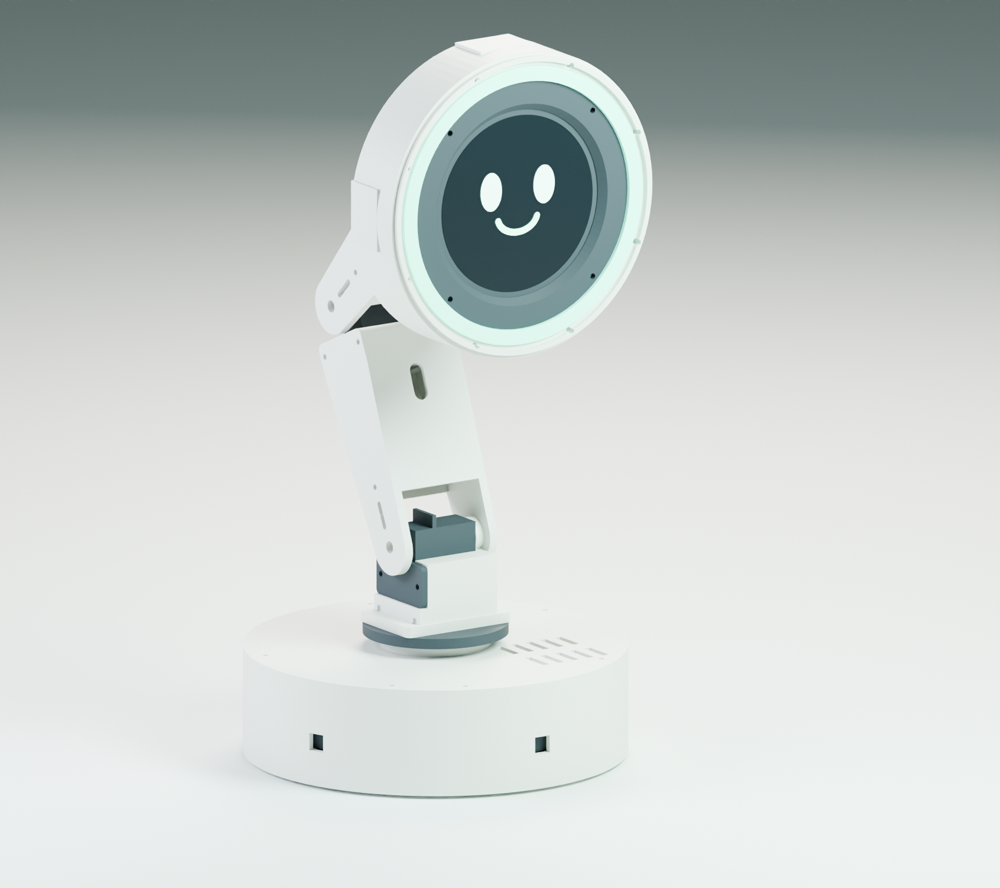

# Meet LUMA

LUMA is a printable Raspberry Pi 4 desk companion with an articulated arm, a circular animated face and two independently controlled light rings. It is an original prototype inspired by the posture and personality of the Autonomous Lamp. It is not a conversion kit for the commercial lamp, and its parts do not claim compatibility with that product.

The head contains a Waveshare ESP32-S3-Touch-LCD-1.85 display, a small white-light ring and a larger RGB halo. The Raspberry Pi makes the behavior decisions. The ESP32-S3 built into the display serves as a graphics peripheral over USB. This preserves the requested Pi 4 control while using the actual QSPI display interface supported by the Waveshare board.

The selected 1.85-inch screen is a 360 × 360 IPS TFT LCD, not an OLED. Its visible circular area is approximately 45.68 mm across. Do not substitute a similarly named Waveshare B, C, AMOLED or bare display module without checking both the mechanical envelope and firmware pin mapping.

Revision C uses four matching on-hand Miuzei DS3218MG 270° servos through the user-selected PCA9685. Each wider enclosed link has a driven straight-horn side and an opposite625-bearing side. All five VL53L1X boards move from external head pods to direct mounts inside the fixed pedestal wall. The optional Waveshare4inch DSI LCD(C) head remains available, keeps the RGB halo, and has no separate white ring.

## What the prototype does

- Wink: one eye closes briefly, the head makes a small gesture and the halo responds.
- Say Hi: a friendly greeting appears on the face, with an audible greeting through the specified audio hardware.
- Be happy: smiling eyes, a bright expression and a gentle arm gesture.
- Sense five horizontal pedestal sectors using Adafruit VL53L1X STEMMA QT boards on separate I2C multiplexer channels.
- Illuminate the face area with the white channel of a 24-pixel RGBW ring and express color with a separate 60-pixel RGB ring.

The provided behavior software runs locally. A conversational language model, camera, microphone, speech recognition and cloud account are not required by this design.

## What is in the project

The printable STL files and editable CAD define the mechanical prototype. The drawings in the back of this manual document those parts. The bill of materials identifies purchased hardware separately from printed parts. Wiring instructions and software source accompany the manual, along with three rendered promotional videos and their editable production scripts.

The project is a digital prototype release. Mesh and software checks can verify files and logic, but they cannot establish physical fit, holding torque, optical performance or print strength. The first assembled unit is the fit-and-function validation build. Record component revision, printer settings and any measured corrections before duplicating it.

## Design choices that matter during assembly

The 55 mm square display board cannot fit through the small light ring's roughly 52.2 mm center. It is installed behind that ring in a separate plane. Follow the head stack order instead of trying to place all boards side by side.

Each enclosed arm link clamps one DS3218 case between its halves. Its driven side uses the servo's straight metal arm, while a625 bearing supports the opposite side. Insert the captive M5 idler nut, servo, lead and harness before closing the three through bolts. The optional4-inch head mounts its display on a carrier plate attached to the display's M4 bosses.

The large RGB ring consists of four purchased 15-pixel quarter boards. Its printed support carries the mechanical load; the solder bridges only connect the electronics. All four arcs are needed to create the complete 60-pixel ring.

Frosted material belongs only over the light rings. Keep the LCD and five pedestal apertures open. A cover over a ranging sensor can create reflection and crosstalk.

The two NeoPixel rings use different pixel formats. The large ring is RGB and the small ring is RGBW. They use separate data outputs and separate driver objects. The normal brightness limits are part of the power and thermal design.

## Reading the drawings

All mechanical dimensions are in millimeters. STL files do not carry a unit declaration: select millimeters in the slicer and confirm the imported bounding dimensions before printing. Use the drawing's stated scale; page fitting in a PDF viewer changes paper scale. Numerical dimensions and the editable model control geometry.

Purchased circuit boards, bearings, fasteners and servo horns are not printable substitutes. Match the exact part numbers in the bill of materials. Minor manufacturing differences are handled by the stated clearances and the first fit coupon, not by forcing a board into a printed pocket.

## Build sequence

1. Check the purchased component revisions and inspect the dimensioned interfaces.
2. Print and measure the fit coupon, then slice the structural parts and diffusers.
3. Bench-test each electrical subsystem before fitting it into the arm.
4. Mount the five sensors inside the pedestal and assemble the base, joint supports and links with motors unpowered.
5. Assemble the layered head, display and light rings.
6. Route and restrain the wiring, leaving service loops at every moving joint.
7. Center each unloaded PWM servo, calibrate neutral pulses/signs and enable a restricted first movement.
8. Validate sensing, fault response, balance, temperature and the three expressions.

## Reference and attribution

The appearance reference is the [Autonomous Lamp](https://www.autonomous.ai/lamp). The LUMA geometry, manual layout and animations are newly authored for this project. Vendor specifications and documentation are identified in the component source register and bill of materials. Promotional files show the digital prototype, not a filmed or physically tested product.
